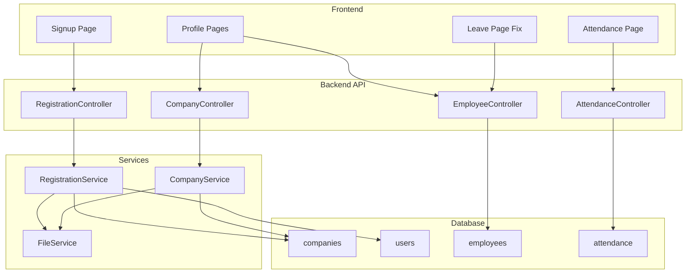

# Design Document

## Overview

This design document covers the implementation of company self-registration, member management, profile pages, and UI improvements for the HRMS application. The features enable new companies to register, manage their employees, and provide profile management for all user types.

## Architecture



## Components and Interfaces

### 1. Registration API

**Endpoint:** `POST /api/auth/register`

**Request:**
```json
{
  "company_name": "string",
  "email": "string",
  "password": "string",
  "company_address": "string (optional)",
  "phone": "string (optional)"
}
```

**Response:**
```json
{
  "success": true,
  "data": {
    "company_id": "number",
    "user_id": "number",
    "message": "Registration successful"
  }
}
```

### 2. Company Profile API

**Endpoint:** `GET /api/company/profile`
**Endpoint:** `PUT /api/company/profile`
**Endpoint:** `POST /api/company/logo`

### 3. User Profile API

**Endpoint:** `GET /api/profile`
**Endpoint:** `PUT /api/profile`

### 4. File Upload Service

Handles logo uploads with:
- File validation (type, size)
- Secure storage in `uploads/logos/` directory
- URL generation for display

## Data Models

### Company (Extended)
```
companies
├── id (PK)
├── name
├── address
├── phone
├── email
├── logo_path (file path)
├── logo_url (public URL)
├── created_at
└── updated_at
```

### File Upload
```
uploads/
├── logos/
│   └── company_{id}_{timestamp}.{ext}
└── profiles/
    └── user_{id}_{timestamp}.{ext}
```

## Correctness Properties

*A property is a characteristic or behavior that should hold true across all valid executions of a system-essentially, a formal statement about what the system should do. Properties serve as the bridge between human-readable specifications and machine-verifiable correctness guarantees.*

### Property 1: Company registration creates linked records
*For any* valid registration data (company name, email, password), submitting registration SHALL create both a company record and an admin user record where the user's company_id matches the created company's id.
**Validates: Requirements 1.2, 1.3**

### Property 2: Logo upload associates with company
*For any* valid image file uploaded during registration or profile update, the company record SHALL have a non-null logo_path that points to an existing file.
**Validates: Requirements 1.4, 5.2**

### Property 3: Employee creation with user account
*For any* valid employee data with user account option enabled, the system SHALL create both an employee record and a user record where the user's employee_id matches the created employee's id.
**Validates: Requirements 2.3**

### Property 4: Default role assignment
*For any* new user account created through employee addition (not by admin), the user's role_id SHALL be the Employee role (role_id = 3).
**Validates: Requirements 2.4**

### Property 5: Leave types populate correctly
*For any* company with leave types defined, opening the leave request form SHALL display all leave types belonging to that company in the dropdown.
**Validates: Requirements 3.1, 3.2**

### Property 6: HR attendance tab filtering
*For any* HR user viewing the "My Attendance" tab, all displayed records SHALL have employee_id matching the HR user's employee_id.
**Validates: Requirements 4.3**

### Property 7: Clock in creates attendance record
*For any* user (Employee or HR) clicking clock in, the system SHALL create an attendance record with the current date and clock_in_time set to current time.
**Validates: Requirements 4.5**

### Property 8: Clock out updates attendance record
*For any* user with an existing clock-in record for today clicking clock out, the system SHALL update that record's clock_out_time and calculate total_hours.
**Validates: Requirements 4.6**

### Property 9: Company logo visibility
*For any* employee of a company with a logo, the dashboard SHALL display the company's logo_url in the header or sidebar.
**Validates: Requirements 5.3**

### Property 10: Profile displays user data
*For any* authenticated user accessing their profile page, the displayed information SHALL match the user's record in the database.
**Validates: Requirements 6.1, 7.1, 8.3**

### Property 11: Profile update persistence
*For any* valid profile update submitted by a user, the corresponding database record SHALL reflect the updated values.
**Validates: Requirements 6.2, 7.2, 8.2**

### Property 12: Sensitive field protection
*For any* employee or HR user attempting to update their profile, the system SHALL reject changes to salary, employee_code, and role_id fields.
**Validates: Requirements 6.4, 7.3**

## Error Handling

| Error Condition | Response Code | Message |
|----------------|---------------|---------|
| Email already exists | 400 | "Email address is already registered" |
| Invalid file type | 400 | "Only JPG, PNG, and GIF images are allowed" |
| File too large | 400 | "File size must be less than 2MB" |
| Company not found | 404 | "Company not found" |
| Unauthorized profile access | 403 | "You can only view your own profile" |

## Testing Strategy

### Unit Testing
- Test registration service creates company and user
- Test file upload validation
- Test profile update field restrictions
- Test leave type loading

### Property-Based Testing

**Library:** PHPUnit with Eris for PHP property-based testing

**Test Configuration:** Each property test runs minimum 100 iterations.

**Property Tests:**
1. Registration round-trip: Register company, verify both records exist and are linked
2. Logo upload: Upload file, verify path exists and file is accessible
3. Employee with user: Create employee with user option, verify both records linked
4. Leave type population: Create leave types, verify all appear in dropdown
5. Attendance filtering: Create mixed attendance records, verify HR sees only own in "My Attendance"
6. Clock in/out: Clock in, verify record created; clock out, verify record updated
7. Profile update: Update allowed fields, verify changes persist; attempt restricted fields, verify rejection

### Integration Testing
- End-to-end registration flow
- Profile update with logo upload
- HR attendance tab switching
- Leave request with type selection
