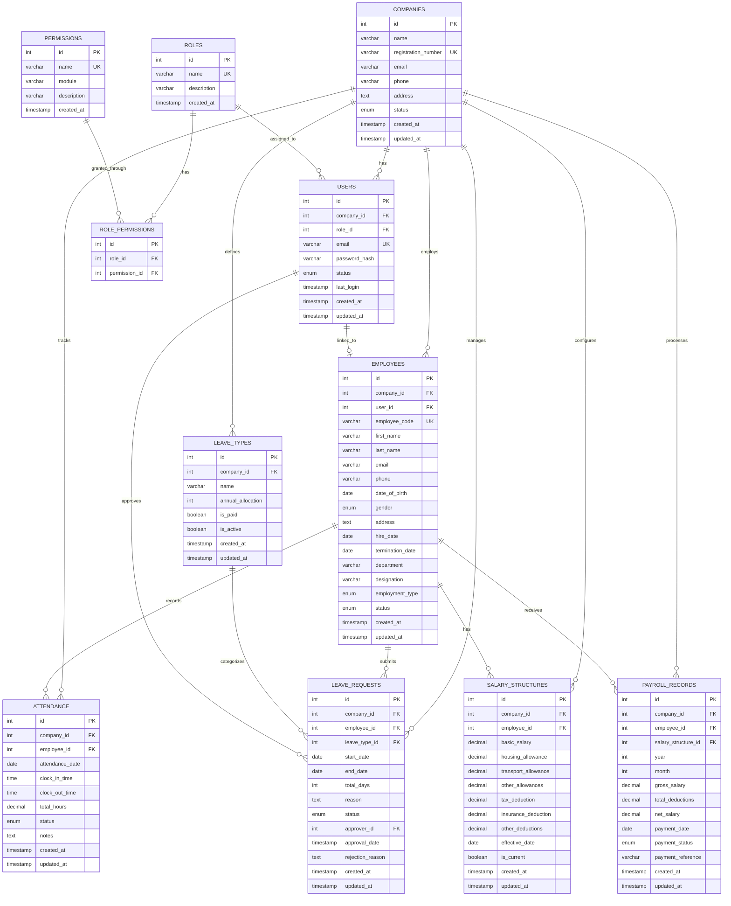

# Design Document: Multi-Company HRMS

## Overview

This document defines the complete database-first design for a Multi-Company Human Resource Management System (HRMS). The system enables multiple organizations to operate on a shared platform while maintaining complete data isolation through a multi-tenant architecture.

The design prioritizes:
- **Data Isolation**: Every tenant-specific table includes `company_id` for strict data separation
- **Normalization**: Third Normal Form (3NF) to eliminate redundancy
- **Referential Integrity**: Foreign keys with appropriate cascade rules
- **Performance**: Strategic indexing on frequently queried columns
- **Scalability**: Modular schema supporting future extensions

## Architecture

### Multi-Tenant Strategy

The system uses a **shared database, shared schema** multi-tenant architecture where:
- All companies share the same database and tables
- Data isolation is enforced through `company_id` foreign key on all tenant-specific tables
- Application layer enforces tenant context in all queries
- Database constraints prevent cross-tenant data access

```
┌─────────────────────────────────────────────────────────────┐
│                    HRMS Platform                            │
├─────────────────────────────────────────────────────────────┤
│  ┌─────────────┐  ┌─────────────┐  ┌─────────────┐         │
│  │  Company A  │  │  Company B  │  │  Company C  │  ...    │
│  │  (Tenant 1) │  │  (Tenant 2) │  │  (Tenant 3) │         │
│  └──────┬──────┘  └──────┬──────┘  └──────┬──────┘         │
│         │                │                │                 │
│         └────────────────┼────────────────┘                 │
│                          ▼                                  │
│              ┌───────────────────────┐                      │
│              │   Shared MySQL DB     │                      │
│              │  (company_id filter)  │                      │
│              └───────────────────────┘                      │
└─────────────────────────────────────────────────────────────┘
```

### Database Layer Architecture

```
┌─────────────────────────────────────────────────────────────┐
│                    Database Schema                          │
├─────────────────────────────────────────────────────────────┤
│  CORE TABLES           │  TENANT TABLES                     │
│  ─────────────         │  ─────────────                     │
│  • companies           │  • users (company_id)              │
│  • roles               │  • employees (company_id)          │
│  • permissions         │  • attendance (company_id)         │
│  • role_permissions    │  • leave_types (company_id)        │
│                        │  • leave_requests (company_id)     │
│                        │  • salary_structures (company_id)  │
│                        │  • payroll_records (company_id)    │
└─────────────────────────────────────────────────────────────┘
```

## Components and Interfaces

### Entity-Relationship Diagram



### Table Relationships Summary

| Parent Table | Child Table | Relationship | Cascade Rule |
|-------------|-------------|--------------|--------------|
| companies | users | 1:N | ON DELETE CASCADE |
| companies | employees | 1:N | ON DELETE CASCADE |
| companies | attendance | 1:N | ON DELETE CASCADE |
| companies | leave_types | 1:N | ON DELETE CASCADE |
| companies | leave_requests | 1:N | ON DELETE CASCADE |
| companies | salary_structures | 1:N | ON DELETE CASCADE |
| companies | payroll_records | 1:N | ON DELETE CASCADE |
| roles | users | 1:N | ON DELETE RESTRICT |
| roles | role_permissions | 1:N | ON DELETE CASCADE |
| permissions | role_permissions | 1:N | ON DELETE CASCADE |
| users | employees | 1:1 | ON DELETE SET NULL |
| users | leave_requests (approver) | 1:N | ON DELETE SET NULL |
| employees | attendance | 1:N | ON DELETE CASCADE |
| employees | leave_requests | 1:N | ON DELETE CASCADE |
| employees | salary_structures | 1:N | ON DELETE CASCADE |
| employees | payroll_records | 1:N | ON DELETE CASCADE |
| leave_types | leave_requests | 1:N | ON DELETE RESTRICT |
| salary_structures | payroll_records | 1:N | ON DELETE RESTRICT |

## Data Models

### 1. Companies Table

Stores organization information for each tenant.

| Column | Type | Constraints | Description |
|--------|------|-------------|-------------|
| id | INT | PK, AUTO_INCREMENT | Unique company identifier |
| name | VARCHAR(255) | NOT NULL | Company name |
| registration_number | VARCHAR(100) | UNIQUE, NOT NULL | Business registration number |
| email | VARCHAR(255) | NOT NULL | Primary contact email |
| phone | VARCHAR(20) | NULL | Contact phone number |
| address | TEXT | NULL | Company address |
| status | ENUM('active','inactive','suspended') | DEFAULT 'active' | Account status |
| created_at | TIMESTAMP | DEFAULT CURRENT_TIMESTAMP | Record creation time |
| updated_at | TIMESTAMP | ON UPDATE CURRENT_TIMESTAMP | Last modification time |

### 2. Roles Table

Defines system roles (Admin, HR, Employee).

| Column | Type | Constraints | Description |
|--------|------|-------------|-------------|
| id | INT | PK, AUTO_INCREMENT | Unique role identifier |
| name | VARCHAR(50) | UNIQUE, NOT NULL | Role name |
| description | VARCHAR(255) | NULL | Role description |
| created_at | TIMESTAMP | DEFAULT CURRENT_TIMESTAMP | Record creation time |

### 3. Permissions Table

Defines granular permissions for RBAC.

| Column | Type | Constraints | Description |
|--------|------|-------------|-------------|
| id | INT | PK, AUTO_INCREMENT | Unique permission identifier |
| name | VARCHAR(100) | UNIQUE, NOT NULL | Permission name (e.g., 'employee.create') |
| module | VARCHAR(50) | NOT NULL | Module name (e.g., 'employee', 'attendance') |
| description | VARCHAR(255) | NULL | Permission description |
| created_at | TIMESTAMP | DEFAULT CURRENT_TIMESTAMP | Record creation time |

### 4. Role_Permissions Table

Junction table for role-permission mapping.

| Column | Type | Constraints | Description |
|--------|------|-------------|-------------|
| id | INT | PK, AUTO_INCREMENT | Unique mapping identifier |
| role_id | INT | FK → roles.id, NOT NULL | Reference to role |
| permission_id | INT | FK → permissions.id, NOT NULL | Reference to permission |
| | | UNIQUE(role_id, permission_id) | Prevent duplicate mappings |

### 5. Users Table

Stores user authentication and authorization data.

| Column | Type | Constraints | Description |
|--------|------|-------------|-------------|
| id | INT | PK, AUTO_INCREMENT | Unique user identifier |
| company_id | INT | FK → companies.id, NOT NULL | Tenant isolation key |
| role_id | INT | FK → roles.id, NOT NULL | User's role |
| email | VARCHAR(255) | UNIQUE, NOT NULL | Login email |
| password_hash | VARCHAR(255) | NOT NULL | Bcrypt hashed password |
| status | ENUM('active','inactive','locked') | DEFAULT 'active' | Account status |
| last_login | TIMESTAMP | NULL | Last successful login |
| created_at | TIMESTAMP | DEFAULT CURRENT_TIMESTAMP | Record creation time |
| updated_at | TIMESTAMP | ON UPDATE CURRENT_TIMESTAMP | Last modification time |

### 6. Employees Table

Stores employee profile information.

| Column | Type | Constraints | Description |
|--------|------|-------------|-------------|
| id | INT | PK, AUTO_INCREMENT | Unique employee identifier |
| company_id | INT | FK → companies.id, NOT NULL | Tenant isolation key |
| user_id | INT | FK → users.id, UNIQUE, NULL | Linked user account |
| employee_code | VARCHAR(50) | NOT NULL | Company-specific employee ID |
| first_name | VARCHAR(100) | NOT NULL | Employee first name |
| last_name | VARCHAR(100) | NOT NULL | Employee last name |
| email | VARCHAR(255) | NOT NULL | Work email |
| phone | VARCHAR(20) | NULL | Contact phone |
| date_of_birth | DATE | NULL | Birth date |
| gender | ENUM('male','female','other') | NULL | Gender |
| address | TEXT | NULL | Home address |
| hire_date | DATE | NOT NULL | Employment start date |
| termination_date | DATE | NULL | Employment end date |
| department | VARCHAR(100) | NULL | Department name |
| designation | VARCHAR(100) | NULL | Job title |
| employment_type | ENUM('full_time','part_time','contract','intern') | DEFAULT 'full_time' | Employment type |
| status | ENUM('active','inactive','terminated') | DEFAULT 'active' | Employment status |
| created_at | TIMESTAMP | DEFAULT CURRENT_TIMESTAMP | Record creation time |
| updated_at | TIMESTAMP | ON UPDATE CURRENT_TIMESTAMP | Last modification time |
| | | UNIQUE(company_id, employee_code) | Unique code per company |

### 7. Attendance Table

Tracks daily attendance records.

| Column | Type | Constraints | Description |
|--------|------|-------------|-------------|
| id | INT | PK, AUTO_INCREMENT | Unique attendance identifier |
| company_id | INT | FK → companies.id, NOT NULL | Tenant isolation key |
| employee_id | INT | FK → employees.id, NOT NULL | Employee reference |
| attendance_date | DATE | NOT NULL | Date of attendance |
| clock_in_time | TIME | NULL | Clock-in timestamp |
| clock_out_time | TIME | NULL | Clock-out timestamp |
| total_hours | DECIMAL(4,2) | NULL | Calculated work hours |
| status | ENUM('present','absent','half_day','late','on_leave') | DEFAULT 'present' | Attendance status |
| notes | TEXT | NULL | Additional notes |
| created_at | TIMESTAMP | DEFAULT CURRENT_TIMESTAMP | Record creation time |
| updated_at | TIMESTAMP | ON UPDATE CURRENT_TIMESTAMP | Last modification time |
| | | UNIQUE(employee_id, attendance_date) | One record per day |

### 8. Leave_Types Table

Defines company-specific leave categories.

| Column | Type | Constraints | Description |
|--------|------|-------------|-------------|
| id | INT | PK, AUTO_INCREMENT | Unique leave type identifier |
| company_id | INT | FK → companies.id, NOT NULL | Tenant isolation key |
| name | VARCHAR(100) | NOT NULL | Leave type name |
| annual_allocation | INT | NOT NULL, DEFAULT 0 | Days allocated per year |
| is_paid | BOOLEAN | DEFAULT TRUE | Paid leave flag |
| is_active | BOOLEAN | DEFAULT TRUE | Active status |
| created_at | TIMESTAMP | DEFAULT CURRENT_TIMESTAMP | Record creation time |
| updated_at | TIMESTAMP | ON UPDATE CURRENT_TIMESTAMP | Last modification time |
| | | UNIQUE(company_id, name) | Unique name per company |

### 9. Leave_Requests Table

Stores employee leave applications.

| Column | Type | Constraints | Description |
|--------|------|-------------|-------------|
| id | INT | PK, AUTO_INCREMENT | Unique request identifier |
| company_id | INT | FK → companies.id, NOT NULL | Tenant isolation key |
| employee_id | INT | FK → employees.id, NOT NULL | Requesting employee |
| leave_type_id | INT | FK → leave_types.id, NOT NULL | Type of leave |
| start_date | DATE | NOT NULL | Leave start date |
| end_date | DATE | NOT NULL | Leave end date |
| total_days | INT | NOT NULL | Number of leave days |
| reason | TEXT | NULL | Leave reason |
| status | ENUM('pending','approved','rejected','cancelled') | DEFAULT 'pending' | Request status |
| approver_id | INT | FK → users.id, NULL | Approving user |
| approval_date | TIMESTAMP | NULL | Approval timestamp |
| rejection_reason | TEXT | NULL | Reason for rejection |
| created_at | TIMESTAMP | DEFAULT CURRENT_TIMESTAMP | Record creation time |
| updated_at | TIMESTAMP | ON UPDATE CURRENT_TIMESTAMP | Last modification time |

### 10. Salary_Structures Table

Defines employee compensation packages.

| Column | Type | Constraints | Description |
|--------|------|-------------|-------------|
| id | INT | PK, AUTO_INCREMENT | Unique structure identifier |
| company_id | INT | FK → companies.id, NOT NULL | Tenant isolation key |
| employee_id | INT | FK → employees.id, NOT NULL | Employee reference |
| basic_salary | DECIMAL(12,2) | NOT NULL | Base salary amount |
| housing_allowance | DECIMAL(12,2) | DEFAULT 0.00 | Housing allowance |
| transport_allowance | DECIMAL(12,2) | DEFAULT 0.00 | Transport allowance |
| other_allowances | DECIMAL(12,2) | DEFAULT 0.00 | Other allowances |
| tax_deduction | DECIMAL(12,2) | DEFAULT 0.00 | Tax deduction |
| insurance_deduction | DECIMAL(12,2) | DEFAULT 0.00 | Insurance deduction |
| other_deductions | DECIMAL(12,2) | DEFAULT 0.00 | Other deductions |
| effective_date | DATE | NOT NULL | Structure effective date |
| is_current | BOOLEAN | DEFAULT TRUE | Current structure flag |
| created_at | TIMESTAMP | DEFAULT CURRENT_TIMESTAMP | Record creation time |
| updated_at | TIMESTAMP | ON UPDATE CURRENT_TIMESTAMP | Last modification time |

### 11. Payroll_Records Table

Stores monthly payroll processing results.

| Column | Type | Constraints | Description |
|--------|------|-------------|-------------|
| id | INT | PK, AUTO_INCREMENT | Unique payroll identifier |
| company_id | INT | FK → companies.id, NOT NULL | Tenant isolation key |
| employee_id | INT | FK → employees.id, NOT NULL | Employee reference |
| salary_structure_id | INT | FK → salary_structures.id, NOT NULL | Salary structure used |
| year | INT | NOT NULL | Payroll year |
| month | INT | NOT NULL, CHECK(1-12) | Payroll month |
| gross_salary | DECIMAL(12,2) | NOT NULL | Total before deductions |
| total_deductions | DECIMAL(12,2) | NOT NULL | Sum of all deductions |
| net_salary | DECIMAL(12,2) | NOT NULL | Take-home amount |
| payment_date | DATE | NULL | Actual payment date |
| payment_status | ENUM('pending','processed','paid','failed') | DEFAULT 'pending' | Payment status |
| payment_reference | VARCHAR(100) | NULL | Payment transaction ref |
| created_at | TIMESTAMP | DEFAULT CURRENT_TIMESTAMP | Record creation time |
| updated_at | TIMESTAMP | ON UPDATE CURRENT_TIMESTAMP | Last modification time |
| | | UNIQUE(employee_id, year, month) | One record per month |

## Correctness Properties

*A property is a characteristic or behavior that should hold true across all valid executions of a system-essentially, a formal statement about what the system should do. Properties serve as the bridge between human-readable specifications and machine-verifiable correctness guarantees.*

Based on the prework analysis, the following correctness properties have been identified:

### Property 1: Multi-Tenant Data Isolation

*For any* query on tenant-specific tables (users, employees, attendance, leave_requests, salary_structures, payroll_records), the results SHALL contain only records where company_id matches the requesting user's company_id.

**Validates: Requirements 1.2, 2.4, 4.2**

### Property 2: Referential Integrity Cascade

*For any* parent record deletion (company, employee, role), child records SHALL be handled according to the defined cascade rules (CASCADE, SET NULL, or RESTRICT) without creating orphaned records.

**Validates: Requirements 1.4, 8.4**

### Property 3: Company Registration Uniqueness

*For any* two company records in the database, their registration_number values SHALL be different.

**Validates: Requirements 2.3**

### Property 4: Admin Auto-Creation on Company Registration

*For any* company record created, there SHALL exist exactly one user record with role_id corresponding to 'Admin' and company_id matching the new company.

**Validates: Requirements 2.2**

### Property 5: Password Hash Round-Trip

*For any* valid password string, hashing with bcrypt and then verifying the original password against the hash SHALL return true.

**Validates: Requirements 3.1**

### Property 6: User-Company-Role Invariant

*For any* user record, the company_id and role_id fields SHALL be non-null and reference valid records in their respective tables.

**Validates: Requirements 3.2, 8.1**

### Property 7: Role-Based Permission Check

*For any* user attempting to access a resource, the access decision SHALL match the result of querying role_permissions for that user's role_id and the required permission.

**Validates: Requirements 3.3**

### Property 8: Timestamp Auto-Population

*For any* INSERT operation on tables with created_at, the created_at field SHALL be auto-populated. *For any* UPDATE operation on tables with updated_at, the updated_at field SHALL change while created_at remains constant.

**Validates: Requirements 4.3, 8.3**

### Property 9: Employee-User One-to-One Relationship

*For any* employee record with a non-null user_id, there SHALL be exactly one user record with that id, and no other employee SHALL reference the same user_id.

**Validates: Requirements 4.4**

### Property 10: Attendance Uniqueness Per Day

*For any* employee_id and attendance_date combination, there SHALL be at most one attendance record.

**Validates: Requirements 5.2**

### Property 11: Total Hours Calculation

*For any* attendance record with both clock_in_time and clock_out_time populated, total_hours SHALL equal the time difference between clock_out_time and clock_in_time in hours.

**Validates: Requirements 5.4**

### Property 12: Leave Balance Calculation

*For any* employee and leave_type combination, the remaining leave balance SHALL equal the leave_type's annual_allocation minus the sum of total_days from approved leave_requests for the current year.

**Validates: Requirements 6.4**

### Property 13: Leave Approval Audit Trail

*For any* leave_request with status 'approved' or 'rejected', the approver_id and approval_date fields SHALL be non-null.

**Validates: Requirements 6.3**

### Property 14: Payroll Net Salary Calculation

*For any* payroll_record, net_salary SHALL equal gross_salary minus total_deductions.

**Validates: Requirements 7.2**

### Property 15: Enum Constraint Enforcement

*For any* INSERT or UPDATE with an invalid enum value for status fields, the database SHALL reject the operation.

**Validates: Requirements 8.2**

## Error Handling

### Database-Level Error Handling

| Error Type | Handling Strategy |
|------------|-------------------|
| Foreign Key Violation | Return descriptive error indicating the constraint violated |
| Unique Constraint Violation | Return error with field name that caused duplication |
| NOT NULL Violation | Return error listing required fields that are missing |
| ENUM Violation | Return error with valid enum values |
| Data Type Mismatch | Return error with expected data type |

### Application-Level Error Handling

- All database operations wrapped in try-catch blocks
- Transaction rollback on multi-step operation failures
- Detailed error logging with sanitized user messages
- Connection pooling with retry logic for transient failures

## Testing Strategy

### Property-Based Testing Library

The system will use **PHPUnit** with **Eris** (PHP property-based testing library) for property-based tests.

### Unit Testing Approach

Unit tests will cover:
- Individual CRUD operations for each table
- Constraint validation (unique, foreign key, enum)
- Calculated field accuracy (total_hours, net_salary)
- Edge cases (null handling, boundary values)

### Property-Based Testing Approach

Property tests will verify:
- Multi-tenant isolation across all tenant-specific tables
- Referential integrity under various deletion scenarios
- Calculation correctness across random input ranges
- Constraint enforcement with generated invalid data

Each property-based test will:
- Run a minimum of 100 iterations
- Be tagged with the format: `**Feature: multi-company-hrms, Property {number}: {property_text}**`
- Reference the specific correctness property being validated

### Test Categories

1. **Schema Validation Tests**: Verify table structure, constraints, and indexes
2. **Data Isolation Tests**: Verify company_id filtering prevents cross-tenant access
3. **Constraint Tests**: Verify unique, foreign key, and enum constraints
4. **Calculation Tests**: Verify computed fields (hours, salary, leave balance)
5. **Cascade Tests**: Verify deletion cascade behavior
6. **Authentication Tests**: Verify password hashing and verification

### Indexing Strategy

| Table | Indexed Columns | Index Type | Purpose |
|-------|-----------------|------------|---------|
| users | company_id | B-TREE | Tenant filtering |
| users | email | UNIQUE | Login lookup |
| employees | company_id | B-TREE | Tenant filtering |
| employees | (company_id, employee_code) | UNIQUE | Code uniqueness |
| attendance | company_id | B-TREE | Tenant filtering |
| attendance | (employee_id, attendance_date) | UNIQUE | Daily uniqueness |
| attendance | attendance_date | B-TREE | Date range queries |
| leave_requests | company_id | B-TREE | Tenant filtering |
| leave_requests | employee_id | B-TREE | Employee lookup |
| leave_requests | status | B-TREE | Status filtering |
| salary_structures | company_id | B-TREE | Tenant filtering |
| salary_structures | employee_id | B-TREE | Employee lookup |
| payroll_records | company_id | B-TREE | Tenant filtering |
| payroll_records | (employee_id, year, month) | UNIQUE | Monthly uniqueness |
